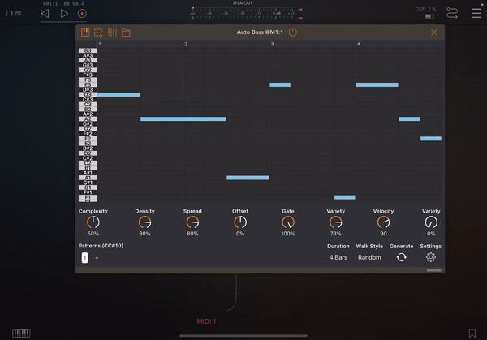

ControlStripView
===

Layout the subviews  
- Horizontally or vertically,   
- Equally spaced if they consume less space then the strip view,  
- Scrolling, with the specified spacing if they consume more space than the strip view.  
- Center or hug the specified items on the strip view optionally.  

Demo 
---



Install
---

Install with swift package manager using this repo's URL

```
https://github.com/cemolcay/ControlStripView.git
```

Usage
---

Create the view:

``` swift
let strip = ControlStripView()
```
  
Create the items conforming `ControlStripViewItem` protocol:

``` swift
class ItemView: UIView, ControlStripViewItem {
	var centerInStripView: Bool = false
	var hugStripView: Bool = false
}
```

Add views to the strip:

``` swift
strip.addItem(cutoffKnob)
strip.addItem(resonanceKnob)
```

Example
---

The repo includes an example usage of the view. 

- Items will scroll on portrait mode, 
- And they will layout with equal spacing on landscape mode.
